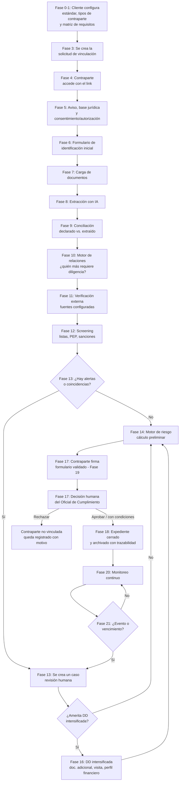

# Flujo de la plataforma — Automatización de Debida Diligencia

> Entregable para [[camilo-caicedo]]. Esta es la **versión 2**, reestructurada
> después de una revisión más profunda del tema (la v1 era una buena
> primera aproximación, pero simplificaba de más algunos puntos que sí
> importan para que esto funcione bien y no genere problemas legales más
> adelante). Si ya empezaste a armar historias de usuario sobre la v1,
> revisa especialmente las secciones 1 y 5 — cambian el modelo de fondo.
>
> Como no vienes del mundo de cumplimiento/compliance, cada concepto nuevo
> se explica en una línea la primera vez que aparece. Contexto de negocio
> completo en [[automatizacion-debida-diligencia]].

## Índice

0. [Por qué esta versión es distinta de la anterior](#0-por-qué-esta-versión-es-distinta-de-la-anterior)
1. [Principio rector: qué es y qué NO es esta plataforma](#1-principio-rector-qué-es-y-qué-no-es-esta-plataforma)
2. [Los 5 conceptos que nunca se deben mezclar](#2-los-5-conceptos-que-nunca-se-deben-mezclar)
3. [Los 6 motores de la plataforma](#3-los-6-motores-de-la-plataforma)
4. [Actores](#4-actores)
5. [Diagrama del flujo completo](#5-diagrama-del-flujo-completo)
6. [Fase 0 — Configuración normativa](#fase-0--configuración-normativa-y-metodológica-del-cliente)
7. [Fase 1 — Tipos de contraparte](#fase-1--configuración-de-tipos-de-contraparte)
8. [Fase 2 — Matriz de requisitos](#fase-2--matriz-de-requisitos-el-módulo-más-importante)
9. [Fase 3 — Solicitud de vinculación](#fase-3--creación-de-la-solicitud-de-vinculación)
10. [Fase 4 — Acceso de la contraparte](#fase-4--acceso-de-la-contraparte)
11. [Fase 5 — Aviso, base jurídica y consentimiento](#fase-5--aviso-base-jurídica-y-consentimiento)
12. [Fase 6 — Identificación inicial](#fase-6--identificación-inicial)
13. [Fase 7 — Documentación](#fase-7--documentación)
14. [Fase 8 — Extracción con IA](#fase-8--extracción-con-ia)
15. [Fase 9 — Conciliación](#fase-9--conciliación)
16. [Fase 10 — Relaciones y beneficiario final](#fase-10--relaciones-y-beneficiario-final)
17. [Fase 11 — Verificación externa](#fase-11--verificación-externa)
18. [Fase 12 — Screening (listas, PEP, sanciones)](#fase-12--screening-listas-pep-sanciones)
19. [Fase 13 — Gestión de alertas](#fase-13--gestión-de-alertas)
20. [Fase 14 — Motor de riesgo](#fase-14--motor-de-riesgo)
21. [Fase 15 — Debida diligencia estándar](#fase-15--debida-diligencia-estándar)
22. [Fase 16 — Debida diligencia intensificada (DDI)](#fase-16--debida-diligencia-intensificada-ddi)
23. [Fase 17 — Decisión](#fase-17--decisión)
24. [Fase 18 — Expediente electrónico](#fase-18--expediente-electrónico)
25. [Fase 19 — Firma electrónica](#fase-19--firma-electrónica)
26. [Fase 20 — Monitoreo continuo](#fase-20--monitoreo-continuo)
27. [Fase 21 — Actualización periódica](#fase-21--actualización-periódica)
28. [Fase 22 — Panel del Oficial de Cumplimiento](#fase-22--panel-del-oficial-de-cumplimiento)
29. [Fase 23 — Auditoría y trazabilidad](#fase-23--auditoría-y-trazabilidad)
30. [Control de acceso por rol (RBAC)](#30-control-de-acceso-por-rol-rbac)
31. [Multiempresa y aislamiento de datos](#31-multiempresa-y-aislamiento-de-datos)
32. [Política de uso de la IA](#32-política-de-uso-de-la-ia)
33. [Datos personales y seguridad](#33-datos-personales-y-seguridad)
34. [Qué NO debe hacer el MVP](#34-qué-no-debe-hacer-el-mvp)
35. [Qué SÍ debe hacer el MVP](#35-qué-sí-debe-hacer-el-mvp)
36. [Qué queda para fase 2](#36-qué-queda-para-fase-2)
37. [Modelo de datos (entidades)](#37-modelo-de-datos-entidades)
38. [Máquina de estados](#38-máquina-de-estados)
39. [Modelo comercial](#39-modelo-comercial)
40. [Responsabilidad contractual](#40-responsabilidad-contractual)
41. [Motor de reglas separado del código + versionamiento normativo](#41-motor-de-reglas-separado-del-código--versionamiento-normativo)
42. [Criterio de "cumplimiento verificable"](#42-criterio-de-cumplimiento-verificable)
43. [Roadmap recomendado](#43-roadmap-recomendado)
44. [Criterio de aceptación del producto](#44-criterio-de-aceptación-del-producto)
45. [Regla de oro para el desarrollo](#45-regla-de-oro-para-el-desarrollo)
46. [Casos borde](#46-casos-borde)
47. [Nota de control normativo](#47-nota-de-control-normativo)

---

## 0. Por qué esta versión es distinta de la anterior

La v1 tenía un problema de fondo: describía un flujo lineal tipo
`formulario → IA → listas → score → aprobar/rechazar`, como si el sistema
pudiera decidir solo. Eso es riesgoso — no solo técnicamente, sino porque
podría hacer creer al cliente que "el software ya cumplió por ellos".

Los cambios de fondo, resumidos:

- La IA **nunca aprueba, rechaza ni declara nada como hecho confirmado** —
  solo lee, extrae, compara y sugiere. Siempre hay una persona autorizada
  detrás de cada decisión.
- No todo nombre que aparece en un documento (accionista, representante,
  etc.) se convierte automáticamente en una "sub-vinculación" — hace falta
  un criterio (un **motor de relaciones**) que decida qué tratamiento le
  corresponde a cada persona relacionada.
- Las listas restrictivas no son solo OFAC + ONU — el sistema debe soportar
  un **catálogo de fuentes configurable** (listas, PEP, sanciones,
  antecedentes, reputación, listas internas del cliente), y una coincidencia
  técnica no es lo mismo que una coincidencia confirmada.
- El "nivel de riesgo" no es una fórmula fija — cada cliente configura su
  propia metodología (factores, pesos, umbrales), porque cada empresa tiene
  su propia política de cumplimiento.
- El consentimiento de datos personales no es un simple checkbox de "Ley
  1581" — el cliente configura su propia base jurídica, avisos y
  autorizaciones según el caso.
- Todo debe quedar **versionado**: qué norma, qué metodología, qué versión
  del formulario se usó para cada expediente — porque las normas cambian, y
  el sistema no puede quedar "cableado" a una sola versión.
- Se agregan módulos que antes no estaban: control de acceso por rol,
  aislamiento entre clientes del SaaS (multiempresa), auditoría como módulo
  central (no un extra), y una política explícita de qué puede y no puede
  hacer la IA.

Con eso en mente, aquí va el flujo completo, de nuevo, ya corregido.

---

## 1. Principio rector: qué es y qué NO es esta plataforma

> **La plataforma automatiza la recolección de evidencia y el flujo de
> trabajo de la debida diligencia. No automatiza el juicio de cumplimiento
> — ese lo sigue haciendo una persona.**

Esto no es un matiz legal sin importancia: es la diferencia entre vender
"un sistema que te ayuda a hacer debida diligencia mejor y más rápido" y
vender "un sistema que decide por ti" — lo segundo genera una expectativa
que el producto no puede cumplir, y puede meter en problemas al cliente si
confía ciegamente en una luz verde automática.

La plataforma **nunca debe prometer**, ni en el producto ni en el marketing:

- "cumplimiento automático";
- "contraparte aprobada automáticamente";
- "debida diligencia 100% automática";
- "riesgo calculado definitivamente por IA";
- "validación jurídica automática";
- "garantía de cumplimiento SARLAFT/SAGRILAFT".

La decisión de vincular, mantener, condicionar o terminar una relación con
una contraparte **siempre es del cliente** (su Oficial de Cumplimiento o
quien tenga esa facultad) — la plataforma le da la información, la
evidencia y las alertas para decidir mejor y más rápido, no decide por él.

El marco normativo colombiano cambia con frecuencia (Ley 1581 de 2012 sobre
datos personales, Ley 527 de 1999 sobre mensajes de datos y firma
electrónica, las normas de SARLAFT/SAGRILAFT que expide la Superintendencia
de Sociedades, y regulación específica del sector transporte de la
Superintendencia de Transporte). El documento fuente de esta reestructuración
cita normas concretas de 2026 (una circular de Supersociedades y una
resolución del sector transporte) que **no hemos verificado de forma
independiente** — quedan anotadas como contexto, no como hecho confirmado
(ver la nota de control normativo al final). Lo importante para el diseño
técnico es la consecuencia práctica: **el sistema no debe construirse
"cableado" a una versión de la norma** — debe poder actualizarse cuando la
norma cambie, sin reescribir el software desde cero (ver sección 41).

---

## 2. Los 5 conceptos que nunca se deben mezclar

Esta es la idea más importante para entender el resto del documento. Todo
el sistema debe distinguir, en todo momento, de dónde viene cada dato:

| #   | Concepto         | En palabras simples                                                                           |
| --- | ---------------- | --------------------------------------------------------------------------------------------- |
| 1   | **Recolección**  | "Esto lo dijo la contraparte" (lo que escribió/subió).                                        |
| 2   | **Extracción**   | "Esto lo leyó la IA" (de un documento).                                                       |
| 3   | **Verificación** | "Esto lo confirmó una fuente externa autorizada" (Cámara de Comercio, RUNT, una lista, etc.). |
| 4   | **Evaluación**   | "El sistema aplicó una regla/fórmula a estos datos" (ej. el cálculo de riesgo).               |
| 5   | **Decisión**     | "Una persona autorizada, con su nombre y cargo, tomó esta decisión."                          |

Nunca deben mezclarse ni presentarse como si fueran lo mismo. Por ejemplo:
que la IA haya "leído" que Juan Pérez es el beneficiario final **no
significa que esté verificado** — solo significa que un documento lo dice y
alguien humano lo tiene que confirmar. Este principio aparece una y otra
vez en las fases de abajo.

---

## 3. Los 6 motores de la plataforma

En vez de pensar la plataforma como "un formulario largo", piénsala como 6
módulos (motores) que se pasan información entre sí:

1. **Onboarding** — recolecta información y documentos de la contraparte.
2. **Verificación** — contrasta lo recolectado contra documentos y fuentes
   externas.
3. **Screening** — consulta listas, PEP, sanciones, antecedentes y otras
   fuentes configuradas.
4. **Risk Engine** (motor de riesgo) — aplica la metodología de riesgo que
   configuró cada cliente.
5. **Case Management** (gestión de casos) — administra alertas, revisiones,
   debida diligencia intensificada y decisiones.
6. **Continuous Monitoring** (monitoreo continuo) — vigila cambios después
   de que la contraparte ya quedó vinculada.

Cada fase de abajo pertenece a uno de estos 6 motores — lo indico entre
paréntesis en cada título.

---

## 4. Actores

- **Cliente del SaaS** — la empresa que usa la plataforma (ej.
  [[dinamica-logistica]]). No es una sola persona: tiene varios roles
  internos con permisos distintos (ver [sección 30](#30-control-de-acceso-por-rol-rbac)):
  - **Administrador** — configura la plataforma para su empresa.
  - **Oficial de Cumplimiento** — responsable legal del proceso, toma las
    decisiones finales.
  - **Analista de Cumplimiento** — revisa expedientes y alertas del día a día.
  - **Revisor/Aprobador** — según la política del cliente, puede tener
    permiso de aprobar o solo de recomendar.
  - **Auditor / Consulta** — solo puede ver, no modificar (para revisiones
    internas o externas).
  - **Usuario operativo** — crea solicitudes de vinculación desde su área
    (comercial, compras, gestión humana, etc.).
- **Contraparte** — la persona o empresa a la que se le hace debida
  diligencia: cliente, proveedor, contratista, empleado, accionista, socio,
  conductor, propietario, poseedor, transportadora aliada, intermediario,
  acreedor, tercero pagador, etc.
- **Persona relacionada** — alguien que "cuelga" de una contraparte:
  representante legal, **beneficiario final** *(quién realmente controla o
  se beneficia de una empresa, aunque no aparezca como accionista
  directo — no es lo mismo que "accionista")*, accionista, administrador,
  miembro de junta, apoderado, propietario/poseedor de un vehículo,
  conductor, u otras relaciones que el cliente configure.
- **Sistema** — ejecuta lo automatizable y permitido: OCR/visión, extracción,
  validaciones, consultas a fuentes, comparación de nombres (*matching*),
  aplicación de reglas, cálculos preliminares, notificaciones, vencimientos,
  monitoreo. **Nunca decide.**

---

## 5. Diagrama del flujo completo



---

## Fase 0 — Configuración normativa y metodológica del cliente

*(Motor: Onboarding — configuración, no ejecución)*

Antes de que exista una sola solicitud de vinculación, el cliente configura
en la plataforma:

- Qué estándar(es) le aplican: SARLAFT, régimen simplificado (cuando
  aplique), SAGRILAFT / el marco vigente de la Superintendencia de
  Sociedades, otros estándares propios del sector, políticas internas.
- Sectores, jurisdicciones y tipos de contraparte que maneja.

**No se debe programar "SAGRILAFT" como una estructura fija en el código.**
En su lugar, la plataforma trabaja con esta cadena:

`Estándar → versión normativa → requisitos → reglas → formulario → documentos → controles`

Esto es lo que permite actualizar el producto cuando cambie la norma, sin
reescribir el sistema.

---

## Fase 1 — Configuración de tipos de contraparte

*(Motor: Onboarding)*

El cliente define, para cada tipo de contraparte que maneja:

- tipo y subtipo (ej. proveedor, cliente, conductor);
- naturaleza (persona natural / jurídica);
- país;
- rol dentro de la operación;
- nivel de exposición esperado;
- documentos y sujetos relacionados que aplican;
- factores de riesgo propios de ese tipo.

Un `Proveedor persona jurídica en Colombia` no tiene por qué requerir lo
mismo que un `Conductor persona natural en Colombia`, ni que un
`Cliente persona jurídica en el extranjero` — cada combinación tiene su
propia configuración (esto alimenta directamente la Fase 2).

---

## Fase 2 — Matriz de requisitos (el módulo más importante)

*(Motor: Onboarding)*

Este es, probablemente, el corazón técnico del producto. No es un simple
`¿documento requerido? Sí/No` — es una tabla configurable con estas
columnas por cada combinación de estándar + tipo de contraparte:

| Campo | Qué define |
|---|---|
| Estándar | SARLAFT / Supersociedades (SAGRILAFT) / interno del cliente |
| Tipo de contraparte | Proveedor, cliente, conductor, etc. |
| Persona | Natural / jurídica |
| Campo requerido | Sí/No — qué dato se le pide |
| Documento soporte | Sí/No — qué archivo hay que cargar |
| Fuente externa | Sí/No — si además se verifica contra una fuente |
| Nivel de riesgo asociado | Bajo/medio/alto |
| Condición de DD intensificada | Qué la dispara para este tipo |
| Periodicidad de actualización | Configurable |
| Vigencia del documento | Configurable |
| ¿Obligatorio? | Sí/No |
| ¿Requiere validación humana? | Sí/No |
| Regla condicional | Ej. "solo si el monto de operación supera X" |
| Versión | Para saber contra qué versión normativa se definió |

Esto convierte la plataforma en un **motor de cumplimiento configurable**,
no en un formulario digital fijo — es lo que le permite a un mismo cliente
(o a distintos clientes del SaaS) tener reglas distintas sin que Camilo
tenga que tocar código cada vez que cambian.

---

## Fase 3 — Creación de la solicitud de vinculación

*(Motor: Onboarding — arranca aquí el ciclo de vida de un expediente)*

El usuario del cliente crea la solicitud indicando: contraparte, tipo, rol,
estándar aplicable, metodología, responsable interno, fecha límite, y (si
aplica) la operación relacionada.

El sistema genera automáticamente: un ID único, el expediente, un token de
acceso, el link, la fecha de expiración del link, y el estado inicial.

**Estados del expediente** (ver máquina de estados completa en la
[sección 38](#38-máquina-de-estados)):

`Borrador → Enviada → En diligenciamiento → Documentos recibidos → En verificación → En análisis → (DDI si aplica) → Pendiente decisión → Aprobada / Condicionada / Rechazada → Cerrada`

---

## Fase 4 — Acceso de la contraparte

*(Motor: Onboarding)*

La contraparte no crea usuario ni contraseña — entra con el link/token. Pero
el sistema debe poder pedir un factor adicional cuando el riesgo lo
justifique: OTP (código de un solo uso) por correo o SMS, u otro mecanismo
de autenticación reforzada.

El sistema registra siempre: fecha, hora, IP, dispositivo, y qué versión
del aviso/consentimiento (Fase 5) aceptó, si aplica.

---

## Fase 5 — Aviso, base jurídica y consentimiento

*(Motor: Onboarding)*

Este es uno de los puntos que más cambia frente a la v1. Antes decía
simplemente "la contraparte acepta el tratamiento de datos (Ley 1581)".
Eso no es incorrecto, pero es incompleto: no todo tratamiento de datos
necesita el mismo tipo de autorización, y un checkbox no vuelve lícito por
sí solo cualquier tratamiento.

La plataforma debe permitir que **el cliente configure**:

- el aviso de privacidad;
- si hace falta autorización explícita (y en qué casos);
- la(s) finalidad(es) del tratamiento;
- quién es el responsable del tratamiento y quién el encargado;
- los derechos del titular de los datos y los canales para ejercerlos;
- qué política aplica;
- qué evidencia de aceptación se guarda (cuando corresponda);
- versión del aviso/política que la persona aceptó, y fecha/hora/medio.

Flujo recomendado:

`Base jurídica que configuró el cliente → se muestra el aviso de privacidad → aceptación/autorización cuando aplica → se registra la evidencia → continúa el proceso`

Si la contraparte no acepta lo que jurídicamente sea necesario: la
solicitud queda **"Rechazada por la contraparte"**, se notifica al cliente,
y el proceso termina ahí para esa persona.

---

## Fase 6 — Identificación inicial

*(Motor: Onboarding)*

Formulario mínimo, distinto según el tipo de contraparte (configurado en la
matriz de la Fase 2). Como referencia:

**Persona natural** (campos configurables, no todos obligatorios siempre):
nombres y apellidos, tipo y número de documento, fecha y lugar de
nacimiento, nacionalidad, actividad económica, dirección, teléfono, correo,
información financiera/bancaria (si aplica), propósito de la relación,
origen de los recursos, si es **PEP** *(Persona Expuesta Políticamente —
alguien que ocupa o ocupó un cargo público relevante, lo que exige mayor
cuidado)*.

**Persona jurídica**: razón social, NIT, país, actividad económica,
domicilio, dirección, teléfono, correo, representante legal, propósito de
la relación, origen de los recursos, estructura de propiedad, beneficiario
final (declarado, pendiente de verificar — ver Fase 10), información
bancaria, si algún relacionado es PEP, jurisdicciones donde opera.

**Nota para el sector transporte**: la normativa específica de ese sector
(citada en el documento fuente, pendiente de verificación legal — ver
sección 47) exige contenido mínimo particular para el conocimiento de
contrapartes de transporte. La plataforma debe soportar una **plantilla
"SARLAFT Transporte"** propia, no forzar la genérica.

---

## Fase 7 — Documentación

*(Motor: Onboarding)*

El sistema muestra la lista de documentos según la matriz configurada
(Fase 2). Cada documento cargado guarda: tipo, emisor, fecha de expedición
y de vencimiento, el archivo, un hash (huella digital del archivo, para
detectar si se alteró), tamaño, formato, versión, estado, fuente, resultado
de la validación, y quién/qué proceso lo validó.

**Estados del documento**: `No recibido → Recibido → En validación → Válido → Requiere revisión → Rechazado → Vencido`

---

## Fase 8 — Extracción con IA

*(Motor: Onboarding / Verificación)*

La IA puede: detectar el tipo de documento, extraer campos, comparar
documentos entre sí, identificar fechas, detectar inconsistencias, extraer
estructuras societarias, identificar nombres, extraer cifras, generar un
resumen.

Cada dato extraído se guarda con: valor, documento fuente, página/zona (si
es posible ubicarla), nivel de confianza del modelo, qué modelo/versión lo
extrajo, y el timestamp.

**Regla de oro de esta fase:**

> La IA **nunca sobrescribe en silencio** lo que la contraparte declaró a
> mano.

Siempre se debe poder ver, lado a lado: `Declarado | Extraído | Diferencia | Fuente | Confianza | Acción requerida`.

---

## Fase 9 — Conciliación

*(Motor: Verificación)*

El sistema compara lo declarado en el formulario, lo extraído de los
documentos, y (cuando aplique) lo que dice una fuente externa. Ejemplo:

`Nombre declarado: ABC S.A.S.` vs. `Cámara de Comercio: ABC LOGÍSTICA S.A.S.`
→ Resultado: **"Inconsistencia — revisión requerida"**.

Nunca debe ocurrir que "la IA corrige automáticamente y el expediente queda
limpio" sin que quede registro de que hubo una diferencia.

---

## Fase 10 — Relaciones y beneficiario final

*(Motor: Verificación)*

Esta fase reemplaza la idea de la v1 de "crear automáticamente una
sub-solicitud para cada nombre que aparezca en un documento". Eso no es
correcto: **no todo actor relacionado necesita el mismo tratamiento**.

En vez de eso, el sistema construye un **grafo de relaciones**:

```
Empresa A
 ├─ representante legal → Persona 1
 ├─ accionista → Empresa B
 ├─ accionista → Persona 2
 ├─ beneficiario final → Persona 3
 └─ apoderado → Persona 4
```

Cada relación guarda: tipo, fuente de donde salió, fecha, porcentaje de
participación (si aplica), evidencia, y estado de verificación.

Con esa información, un **motor de relaciones** decide — según el tipo de
relación y la metodología configurada por el cliente — qué necesita cada
persona: identificación, consulta a listas, revisión de PEP, documentación
propia, debida diligencia completa, debida diligencia intensificada, o
simplemente quedar registrada como relacionada sin más trámite.

Ejemplo de la diferencia: un `representante legal` casi siempre requiere
identificación y *screening* (ver Fase 12). Un `accionista minoritario` no
necesariamente requiere exactamente lo mismo que un `beneficiario final` —
la plataforma debe permitir esa diferencia, no tratarlos igual por defecto.

La determinación de quién es el beneficiario final de una empresa **no se
da por completa solo con la Cámara de Comercio** — ese documento ayuda a
identificar administradores y cierta información societaria, pero puede no
bastar para el beneficiario final real. El sistema puede sugerir "falta
verificar a la Persona 3 como beneficiario final", pero esa determinación
siempre queda sujeta a revisión humana.

---

## Fase 11 — Verificación externa

*(Motor: Verificación)*

Debe existir un **catálogo de fuentes**, no fuentes fijas en el código.
Cada fuente registrada guarda: nombre, URL/API, proveedor, tipo, país,
cobertura, frecuencia de actualización, condiciones de uso, costo, y para
cada consulta puntual: fecha, hora, respuesta, evidencia, disponibilidad
del servicio en ese momento.

Tipos de fuente a contemplar: registros empresariales (Cámara de Comercio /
RUES), identidad, RUNT, otras autoridades, listas restrictivas, PEP,
sanciones, antecedentes, medios de comunicación, fuentes comerciales.

La plataforma siempre distingue: **dato declarado** / **dato extraído** /
**dato verificado** / **dato no verificable** — nunca los presenta como si
fueran equivalentes.

---

## Fase 12 — Screening (listas, PEP, sanciones)

*(Motor: Screening)*

**12.1 — Fuentes de listas**: no limitarse a OFAC + ONU (como decía la v1).
Configurable, como mínimo: listas vinculantes en Colombia, ONU, listas
internacionales adicionales (según la política del cliente), sanciones
administrativas, antecedentes, fuentes reputacionales, listas internas del
propio cliente, listas de terceros autorizados, fuentes comerciales.

**12.2 — PEP**: identificación y revisión de si la persona es o fue
Persona Expuesta Políticamente.

**12.3 — Matching (comparación de nombres)**: debe soportar coincidencia
exacta, por similitud, alias, nombres invertidos, errores de digitación,
homónimos, transliteraciones (nombres escritos en otro alfabeto/idioma), e
identificadores (cédula, NIT, pasaporte).

**12.4 — Resultado del matching** — este es el punto clave que la v1 no
tenía: una coincidencia técnica **no significa que la persona esté
sancionada**. El flujo correcto es:

`Coincidencia técnica (la encontró el sistema) → revisión humana → comparación de identificadores → se descarta / coincidencia probable / coincidencia confirmada → decisión`

Los resultados posibles son: `Sin coincidencia`, `Posible coincidencia`,
`Coincidencia descartada`, `Coincidencia confirmada`, `Pendiente revisión`.
La revisión humana de cada coincidencia queda siempre documentada.

---

## Fase 13 — Gestión de alertas

*(Motor: Case Management)*

Toda alerta (coincidencia posible, inconsistencia, riesgo alto, documento
vencido, etc.) se convierte en un **caso**, que agrupa: la alerta, su
fuente, la persona/contraparte afectada, la evidencia, la fecha, quién lo
analizó, el análisis, la decisión tomada sobre ese caso, la justificación,
quién aprobó, y el cierre.

**Nunca se puede cerrar una alerta sin justificación registrada.**

---

## Fase 14 — Motor de riesgo

*(Motor: Risk Engine)*

Cada cliente configura su propia metodología — no hay una matriz universal
impuesta por la plataforma. Se configuran: factores de riesgo (tipo de
contraparte, producto/servicio, canal, jurisdicción, actividad económica,
si es PEP, resultados de listas, antecedentes, volumen de operación,
estructura societaria, comportamiento, señales de alerta), sus
ponderaciones, escalas, umbrales y reglas de escalamiento, con fecha de
vigencia y versión.

El sistema calcula: riesgo inherente → controles aplicados → riesgo
residual → factores críticos → nivel final.

Punto clave: el sistema distingue entre el **cálculo automático
preliminar** y la **clasificación final**, que debe quedar aprobada por la
persona responsable — con posibilidad de revisar, ajustar de forma
justificada, hacer un *override* autorizado, o pedir una segunda
aprobación. Nunca debe existir como única ruta: `IA calcula riesgo alto → rechazo automático`.

---

## Fase 15 — Debida diligencia estándar

*(Motor: Case Management)*

Si no hay factores que obliguen a intensificar (Fase 16): expediente
completo con verificaciones, *screening*, análisis y riesgo ya resueltos →
pasa directo a la Fase 17 (Decisión).

---

## Fase 16 — Debida diligencia intensificada (DDI)

*(Motor: Case Management)*

La plataforma permite activar DDI cuando: la persona es PEP, la
jurisdicción es de alto riesgo, hay una coincidencia confirmada en listas,
la estructura societaria es compleja, el beneficiario final no está claro,
hay información inconsistente, aparecen señales de alerta, las operaciones
son atípicas, el riesgo calculado es alto, o por cualquier otra regla que
el cliente configure.

En DDI, el Oficial de Cumplimiento puede solicitar (todo gestionado desde
la misma plataforma, sin salir de ella): información adicional, soportes
del origen de los recursos, soportes financieros, documentos societarios
adicionales, información sobre el beneficiario final, referencias
comerciales/personales, una **visita presencial** (con un checklist digital
que se completa desde la plataforma: fotos, notas, firma de quien visita),
una entrevista, explicación de la operación, aprobación de la alta
gerencia, o controles adicionales.

**La plataforma gestiona la DDI — no determina por sí sola qué evidencia
es jurídicamente suficiente.**

---

## Fase 17 — Decisión

*(Motor: Case Management)*

La decisión **siempre es humana y siempre trazable**. Opciones: aprobar,
aprobar con condiciones, no aprobar, rechazar, solicitar más información,
suspender, terminar la relación.

Antes de esta fase, la contraparte revisa el formulario ya autollenado
(Fases 8-9), corrige si hace falta, y **firma electrónicamente** (ver Fase
19) — solo entonces el expediente llega completo a manos del Oficial de
Cumplimiento para decidir.

Campos obligatorios de la decisión: responsable, fecha, fundamento de la
decisión, evidencia en la que se basó, condiciones (si aplica), y vigencia
de la vinculación.

---

## Fase 18 — Expediente electrónico

*(Motor: Case Management / transversal a todo el flujo)*

El expediente debe permitir reconstruir, en cualquier momento, toda la
historia:

> Qué se preguntó → qué respondió la contraparte → qué documento entregó →
> qué verificó el sistema → qué alerta apareció → quién la analizó → qué
> decisión se tomó → por qué → qué pasó después.

Debe conservar: la información original, los documentos originales y sus
versiones, las consultas realizadas y sus resultados, las alertas, las
decisiones, los logs con fecha/hora, los usuarios que intervinieron, los
cambios realizados, y la evidencia del consentimiento/aviso cuando
corresponda. La Ley 527 de 1999 (a verificar en su alcance exacto, ver
sección 47) reconoce efectos jurídicos a los mensajes de datos electrónicos
y exige que se puedan conservar de forma íntegra y accesible — el diseño
del expediente electrónico debe tener esto presente.

---

## Fase 19 — Firma electrónica

*(Motor: Onboarding — ocurre dentro de la Fase 7/17, se detalla aparte por su importancia legal)*

La v1 decía que "IP + timestamp + hash = firma legalmente válida en
cualquier circunstancia". Eso es una simplificación que hay que corregir:
según la Ley 527 de 1999 (pendiente de verificación legal específica), lo
que se exige es un método que permita identificar a quien firma y
demuestre su aprobación, siendo confiable y apropiado para el propósito —
la firma digital certificada tiene requisitos adicionales más estrictos.

Por eso, la plataforma debe ofrecer **niveles configurables**, y que sea el
cliente quien decida cuál necesita según su política:

- **Nivel 1** — Aceptación electrónica simple con evidencia (IP,
  fecha/hora, hash del documento).
- **Nivel 2** — Firma electrónica reforzada (algún factor adicional de
  verificación de identidad).
- **Nivel 3** — Firma digital/certificada, a través de un proveedor
  especializado externo.

No prometer que el Nivel 1 sirve "para cualquier circunstancia" — depende
del caso y del nivel de riesgo que el cliente quiera cubrir.

---

## Fase 20 — Monitoreo continuo

*(Motor: Continuous Monitoring)*

El monitoreo no termina cuando se aprueba la vinculación, y **no se limita
a volver a consultar listas**. Debe cubrir eventos como: nueva coincidencia
en listas, cambio en la condición de PEP, cambio societario, cambio de
beneficiario final, cambio de representante legal, cambio de jurisdicción,
documento vencido, cambio de cuenta bancaria, nueva sanción, nueva alerta,
o cambio en el nivel de riesgo calculado.

Cada evento sigue el mismo patrón que ya vimos: `Evento → alerta → caso (Fase 13) → revisión humana → decisión`.

---

## Fase 21 — Actualización periódica

*(Motor: Continuous Monitoring)*

La periodicidad de actualización **no es una regla universal** (ej. "todos
cada año"). Se calcula según: el riesgo de la contraparte, el tipo de
contraparte, la metodología del estándar aplicable, el vencimiento de
documentos específicos, o eventos extraordinarios que disparen una
actualización fuera de calendario.

`Periodicidad = metodología del cliente + estándar aplicable + nivel de riesgo + eventos`

---

## Fase 22 — Panel del Oficial de Cumplimiento

*(Motor: Case Management / Continuous Monitoring — vista transversal)*

Dashboard mínimo, con estas categorías:

- **Expedientes**: total, nuevos, incompletos, en análisis, en DDI,
  aprobados, condicionados, rechazados.
- **Riesgo**: distribución bajo/medio/alto, cambios recientes.
- **Alertas**: por listas, por PEP, por inconsistencias, por documentos,
  por vencimientos, por monitoreo.
- **Gestión**: tiempos de respuesta (SLA), pendientes, casos repetidos,
  productividad del equipo.
- **Auditoría**: decisiones tomadas, modificaciones, *overrides*, consultas
  realizadas, evidencia disponible.

---

## Fase 23 — Auditoría y trazabilidad

*(Transversal — debe considerarse núcleo del producto, no un extra)*

Debe existir un registro de auditoría (audit log) inmutable o
técnicamente protegido, que registre siempre: quién, qué, cuándo, desde
dónde, el valor anterior y el nuevo, el motivo del cambio, la fuente, si
fue un proceso automático o manual, qué modelo de IA intervino, y la
versión de la regla/norma vigente en ese momento.

Atención especial a: cambios en el nivel de riesgo, cambios de beneficiario
final, decisiones tomadas, eliminación o reemplazo de documentos,
resolución de alertas, y cualquier *override* manual.

---

## 30. Control de acceso por rol (RBAC)

La plataforma implementa control de acceso basado en roles (*Role-Based
Access Control*). Ejemplo de matriz base (el cliente puede ajustar según su
propia segregación de funciones):

| Función | Contraparte | Analista | Oficial de Cumplimiento | Auditor |
|---|:---:|:---:|:---:|:---:|
| Crear solicitud | ✓ | ✓ | ✓ | — |
| Revisar documentos | — | ✓ | ✓ | solo consulta |
| Resolver alerta | — | ✓ | ✓ | solo consulta |
| Modificar metodología | — | — | ✓ | solo consulta |
| Aprobar | — | según política | ✓ | — |
| Rechazar | — | según política | ✓ | — |
| Ver auditoría | — | ✓ | ✓ | ✓ |

---

## 31. Multiempresa y aislamiento de datos

Esto es crítico por ser un SaaS. Cada cliente (tenant) tiene: usuarios
propios, expedientes independientes, configuración y claves
independientes, políticas y matrices propias, y logs propios.

> **Regla crítica**: los datos de una contraparte no se reutilizan entre
> distintos clientes del SaaS para fines de cumplimiento, salvo que exista
> una base jurídica, contractual y técnica que lo permita expresamente.

Aunque dos clientes del SaaS conozcan a la misma contraparte (ej. el mismo
proveedor de transporte), en el MVP cada uno mantiene su propio expediente,
separado del otro.

---

## 32. Política de uso de la IA

Para cada uso de IA en la plataforma se registra: modelo, proveedor,
versión, fecha, la plantilla de instrucciones usada (si aplica), el
documento fuente, el resultado, el nivel de confianza, quién lo validó, y
el resultado final ya validado.

**La IA nunca puede**: inventar datos, completar campos sin dejar constancia
de que lo hizo ella, convertir una inferencia en un hecho confirmado,
eliminar una discrepancia detectada, cerrar una alerta por su cuenta,
aprobar o rechazar una vinculación, o modificar un documento original.

---

## 33. Datos personales y seguridad

Por el tipo de información que procesa (documentos de identidad, datos
financieros, información societaria), la privacidad y la seguridad son
parte del diseño desde el principio, no un añadido posterior. Debe
contemplar: minimización de datos (pedir solo lo necesario), finalidad
clara, control de acceso, cifrado, segregación de datos por cliente,
gestión segura de sesiones, logs, copias de seguridad y recuperación,
tiempos de retención y eliminación/anonimización cuando corresponda,
gestión de solicitudes de los titulares de los datos, gestión de
incidentes de seguridad, control sobre proveedores/subencargados que
procesen datos, dónde se almacenan los datos, y si hay transferencia
internacional de datos (por ejemplo, si se usa un proveedor de IA con
servidores fuera de Colombia).

---

## 34. Qué NO debe hacer el MVP

Para no sobre-prometer ni sobre-construir:

- Garantizar cumplimiento regulatorio.
- Reemplazar al Oficial de Cumplimiento.
- Emitir conceptos jurídicos automáticos.
- Determinar beneficiarios finales sin revisión humana.
- Declarar positivos automáticamente los resultados de *matching*.
- Rechazar automáticamente por aparecer en una lista.
- Compartir expedientes entre distintos clientes del SaaS.
- Asumir una única matriz de riesgo para todos los clientes.
- Asumir una única periodicidad de actualización para todos.
- Asumir que todos los documentos tienen la misma vigencia.
- Depender de una única fuente para verificar identidad.
- Limitar el *screening* a solo OFAC y ONU.
- Tratar a la IA como una autoridad de decisión.
- Convertir el formulario en la totalidad de la debida diligencia (el
  formulario es un insumo, no el proceso completo).

## 35. Qué SÍ debe hacer el MVP

1. Multiempresa (aislamiento por cliente).
2. Usuarios y roles (RBAC).
3. Configuración normativa (Fase 0).
4. Tipos de contraparte (Fase 1).
5. Matriz de requisitos (Fase 2).
6. Solicitudes de vinculación (Fase 3).
7. Portal de acceso de la contraparte (Fase 4).
8. Formularios dinámicos (Fase 6).
9. Gestión documental (Fase 7).
10. OCR/IA de extracción (Fase 8).
11. Conciliación (Fase 9).
12. Relaciones y beneficiario final (Fase 10).
13. *Screening* a través de proveedores/fuentes configuradas (Fase 12).
14. Gestión de alertas (Fase 13).
15. Motor de riesgo configurable (Fase 14).
16. Debida diligencia estándar (Fase 15).
17. Debida diligencia intensificada (Fase 16).
18. Decisión humana (Fase 17).
19. Expediente electrónico (Fase 18).
20. Auditoría (Fase 23).
21. Monitoreo (Fase 20).
22. Renovaciones/actualización periódica (Fase 21).
23. Panel/dashboard (Fase 22).
24. Exportación de reportes.

## 36. Qué queda para fase 2

Integración RUNT avanzada, integraciones bancarias, análisis de medios
adversos (*adverse media*) avanzado, grafos de relaciones más complejos,
análisis transaccional, modelos de machine learning propios para riesgo,
analítica predictiva, APIs masivas para integrarse con otros sistemas del
cliente, integración con ERP/TMS del cliente, monitoreo transaccional,
*scoring* dinámico por comportamiento, portal para auditores externos,
comparativas sectoriales (*benchmarking*).

---

## 37. Modelo de datos (entidades)

Punto de partida para el modelo de datos (el diseño final de tablas/base de
datos es decisión tuya):

Tenant (empresa cliente), Usuario, Rol, Política, Estándar, Versión
normativa, Metodología, Factor de riesgo, Regla, Tipo de contraparte,
Solicitud, Expediente, Persona, Organización, Relación, Beneficiario
final, Documento, Tipo documental, Fuente, Verificación, Screening, Match
(coincidencia), Alerta, Caso, Riesgo, DDI, Decisión, Condición, Monitoreo,
Evento, Renovación, Consentimiento/registro jurídico aplicable, Audit Log,
Modelo de IA, Ejecución de IA.

---

## 38. Máquina de estados

Ruta principal:

```
BORRADOR → ENVIADA → DILIGENCIANDO → DOCUMENTOS_RECIBIDOS
→ VALIDACIÓN → VERIFICACIÓN → SCREENING → ANÁLISIS_RIESGO
→ DD_ESTÁNDAR → DECISIÓN → { APROBADA | CONDICIONADA | RECHAZADA }
→ MONITOREO → ACTUALIZACIÓN
```

Ruta alternativa cuando hay alerta o riesgo alto:

```
ALERTA / RIESGO ALTO → REVISIÓN HUMANA → DDI → ANÁLISIS → DECISIÓN
```

---

## 39. Modelo comercial

El SaaS no se debería vender como *"te hacemos el SARLAFT/SAGRILAFT"*, sino
como:

> **"Automatizamos y dejamos trazado tu proceso de debida diligencia, para
> que tu equipo de cumplimiento dedique su tiempo a analizar riesgos y
> tomar decisiones, no a perseguir documentos."**

Es una diferencia comercial y también legalmente más segura para nosotros
como proveedores del software.

---

## 40. Responsabilidad contractual

El contrato del SaaS con cada cliente debería separar claramente:

- **El SaaS (nosotros) responde por**: disponibilidad del servicio,
  seguridad, funcionamiento, integridad tecnológica, trazabilidad,
  procesamiento conforme a lo contratado, integraciones, mantenimiento.
- **El cliente responde por**: su metodología, sus políticas, cómo define
  sus requisitos, cómo clasifica el riesgo, sus decisiones, el cumplimiento
  de sus propias obligaciones regulatorias, la actuación de su Oficial de
  Cumplimiento, la veracidad de la información que suministra, y el uso
  adecuado de la plataforma.
- **Los proveedores de datos externos (listas, screening, etc.) responden
  por**: la calidad, disponibilidad y actualización de su información, y
  las condiciones de licenciamiento de su uso.

---

## 41. Motor de reglas separado del código + versionamiento normativo

La plataforma debe tener una capa de **reglas de cumplimiento** separada
del resto del código de la aplicación:

```
Normativa → Requisitos → Reglas → Campos → Documentos → Validaciones → Alertas → Workflow
```

Cuando cambie una norma, lo que se actualiza es la configuración/versión de
las reglas — no hay que reconstruir el software completo.

Por eso, cada expediente debe guardar con qué versión de la norma y de la
metodología fue evaluado: estándar, norma, versión, fecha de vigencia,
metodología, versión de la matriz de requisitos, versión de las reglas, y
versión del formulario usado. Esto es indispensable para cualquier
auditoría futura.

---

## 42. Criterio de "cumplimiento verificable"

Una plataforma madura no se limita a mostrar `Cumplido: Sí/No`. Debe poder
mostrar la cadena completa:

```
Requisito → Dato requerido → Documento → Fuente de verificación
→ Resultado → Alerta → Análisis → Decisión → Evidencia
```

Esa cadena completa, reconstruible en cualquier momento, es el verdadero
producto — no el formulario en sí.

---

## 43. Roadmap recomendado

- **MVP 1 — Debida diligencia documental**: onboarding, formularios,
  documentos, OCR, conciliación, expediente, trazabilidad.
- **MVP 2 — Screening y riesgo**: listas, PEP, fuentes, *matching*,
  alertas, matriz de riesgo, DDI.
- **MVP 3 — Monitoreo**: re-*screening*, eventos, renovaciones, alertas,
  actualización periódica.
- **MVP 4 — Integraciones**: RUNT, RUES/Cámara de Comercio, fuentes
  oficiales adicionales, proveedores de *screening*, ERP/TMS del cliente,
  APIs.
- **MVP 5 — Inteligencia avanzada**: grafos de relaciones más complejos,
  analítica, detección de patrones de comportamiento, modelos predictivos.

---

## 44. Criterio de aceptación del producto

El MVP está bien diseñado si, ante una eventual auditoría, el cliente puede
demostrar con la plataforma:

A. Quién era la contraparte. B. Qué información entregó. C. Qué documentos
presentó. D. Qué información fue extraída automáticamente. E. Qué
información fue verificada. F. Qué fuentes fueron consultadas. G. Qué
alertas aparecieron. H. Quién analizó las alertas. I. Qué metodología de
riesgo se aplicó. J. Qué nivel de riesgo resultó. K. Si hubo debida
diligencia intensificada. L. Quién tomó la decisión. M. Por qué la tomó.
N. Qué condiciones quedaron. O. Cuándo debe actualizarse. P. Qué ocurrió
durante el monitoreo.

Si la plataforma puede responder estas 16 preguntas para cualquier
expediente, cumple su propósito.

---

## 45. Regla de oro para el desarrollo

> **No desarrollar primero la pantalla. Desarrollar primero el modelo de
> cumplimiento.**

Orden recomendado del proyecto:

```
1. Marco normativo       6. Fuentes           11. Decisiones
2. Requisitos            7. Reglas            12. Evidencia
3. Tipos de contraparte  8. Riesgo            13. Seguridad
4. Datos                 9. Alertas           14. UX/UI
5. Documentos           10. Workflows         15. Desarrollo
```

No al revés — construir primero las pantallas bonitas sin tener claro el
modelo de cumplimiento detrás es la forma más rápida de tener que
reescribir todo después.

---

## 46. Casos borde

Además de lo ya mencionado en cada fase, tener presente para las historias
de usuario:

- **La contraparte no completa el proceso a tiempo**: recordatorios
  automáticos antes de que expire el link; qué pasa si expira sin
  completarse.
- **Documento ilegible o rechazado**: reintento, sin perder lo ya
  diligenciado en otras fases.
- **Actor relacionado ya identificado en otro expediente vigente** (mismo
  representante legal o accionista en otra vinculación, del mismo
  cliente): reutilizar su información en vez de volver a pedirle todo —
  siempre que la base jurídica y la vigencia lo permitan.
- **Multiempresa**: dos clientes del SaaS vinculando a la misma
  contraparte por separado — cada uno con su propio expediente
  independiente (ver [sección 31](#31-multiempresa-y-aislamiento-de-datos)).
- **Coincidencia en listas después de ya vinculada** (Fase 20): dispara
  una alerta inmediata, no espera al ciclo de actualización periódica.

---

## 47. Nota de control normativo

Este documento es una **especificación funcional de producto**, construida
a partir de una revisión hecha por Juan David con apoyo de otras fuentes —
**no es un concepto jurídico ni una certificación de cumplimiento**. Cita
normas puntuales (una circular de la Superintendencia de Sociedades y una
resolución del sector transporte, ambas de 2026, además de la Ley 527 de
1999 y la Ley 1581 de 2012) que **no han sido verificadas de forma
independiente** en este proceso — se mantienen como contexto de diseño, no
como hecho legal confirmado.

Antes de comercializar la plataforma como una solución de cumplimiento, se
recomienda una **revisión jurídica independiente** de: el régimen
normativo aplicable, el tratamiento de datos personales, los contratos
Responsable/Encargado del tratamiento, las fuentes de información y su
licenciamiento, la validez de la firma electrónica en cada nivel ofrecido,
la conservación documental, las transferencias internacionales de datos,
el uso de IA, las responsabilidades contractuales, y cualquier afirmación
comercial ("*claim*") que se haga sobre lo que el SaaS garantiza.

## 🔗 Relacionado

- [[automatizacion-debida-diligencia]]
- [[propuesta-camilo-caicedo]]
- [[camilo-caicedo]]
- [[dinamica-logistica]]

#proyecto #tema/compliance
