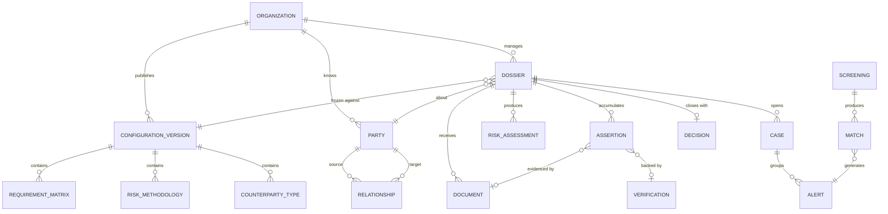

# Modelo conceptual

Derivado de la §37 del
[documento funcional del cliente](../01-descubrimiento/entregables-cliente/2026-08-21-flujo-plataforma-debida-diligencia-v2.md),
y gobernado por `ADR-0004` (configuración versionada) y `ADR-0005` (procedencia del dato).

## Los cuatro planos

El error a evitar es modelar esto como un solo grafo de tablas. Son **cuatro planos con
reglas distintas**, y mezclarlos es lo que rompe la auditoría:

| Plano | Qué contiene | Regla |
|---|---|---|
| **Configuración** | Estándar, versión normativa, metodología, factores, reglas, matriz de requisitos, tipos de contraparte, catálogo de fuentes, roles | **Inmutable y versionado.** Nunca se edita: se publica una versión nueva |
| **Sujetos** | Persona, Organización, Relación — a nivel de organización cliente, no de expediente | Reutilizables entre expedientes del **mismo** cliente (§46). Nunca entre clientes (§31) |
| **Expediente** | Solicitud, Expediente, Afirmación, Documento, Verificación, Screening, Coincidencia, Alerta, Caso, Evaluación de riesgo, DDI, Decisión, Condición, Consentimiento, Firma | Se congela contra una versión de configuración |
| **Bitácora** | Audit Log, Ejecución de IA, Evento de monitoreo, Renovación | **Solo inserción.** Es el sustrato, no un módulo |

## Diagrama

> Nombres de entidad en inglés desde el 2026-09-06 (`05-datos/diccionario-de-datos.md`):
> este diagrama es la forma más cercana a un esquema que hay en `jdlargo-specs`, así que
> sigue la regla de "código en inglés" (`AGENTS.md` raíz §5.4) aunque el resto del documento
> esté en español. `ORGANIZATION` es siempre la organización cliente (el *tenant*); una
> organización como tipo de `PARTY` es `LEGAL_ENTITY`, nunca `ORGANIZATION` — ver la
> advertencia del diccionario.

## Decisiones de modelado que no son obvias

**Los sujetos viven a nivel de organización cliente, no dentro del expediente.** El caso
borde de la §46 —el mismo representante legal aparece en otra vinculación del mismo
cliente— exige que Persona y Organización se puedan reutilizar. Pero la §31 prohíbe
reutilizarlos entre clientes del SaaS: si dos clientes conocen al mismo proveedor, hay dos
sujetos distintos y dos expedientes independientes.

**Las relaciones son aristas de primera clase**, con tipo, fuente, fecha, porcentaje de
participación, evidencia y estado de verificación (Fase 10). No son columnas en una tabla de
personas. Esto es lo que permite el grafo de vinculación y las consultas recursivas.

**El expediente apunta a una versión de configuración, no a la configuración vigente.** Es la
diferencia entre poder reconstruir una auditoría de hace dos años y no poder.

**Una coincidencia de screening no es una alerta, y una alerta no es un caso.** Son tres
entidades: el sistema produce coincidencias, las que superan el umbral se vuelven alertas, y
las alertas se agrupan en casos que una persona resuelve. Colapsarlas es lo que lleva al
"rechazo automático por aparecer en una lista" que el documento prohíbe expresamente (§34).

## Entidades pendientes de detallar

Todas las de la §37 no cubiertas arriba: Política, Condición, Renovación, Tipo documental,
Modelo de IA. Se detallan en `diccionario-de-datos.md` a medida que se escriban las historias
de cada bloque.
