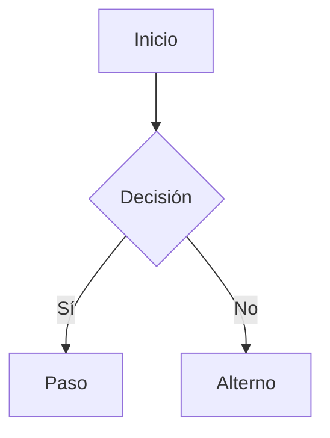

# FL-xxx — <nombre>

## Objetivo del actor
<Qué quiere lograr y en qué momento.>

## Actor principal
<...>  |  **Otros participantes:** <...>

## Precondiciones
- <...>

## Camino principal
1. <paso>
2. <paso>

## Caminos alternos
- **A1** <cuándo ocurre> → <qué pasa>

## Errores y excepciones
- **E1** <situación> → <manejo esperado>

## Postcondiciones
- <estado final del sistema, evidencia registrada>

## Diagrama

## Historias que lo implementan
- `HU-xxx`
